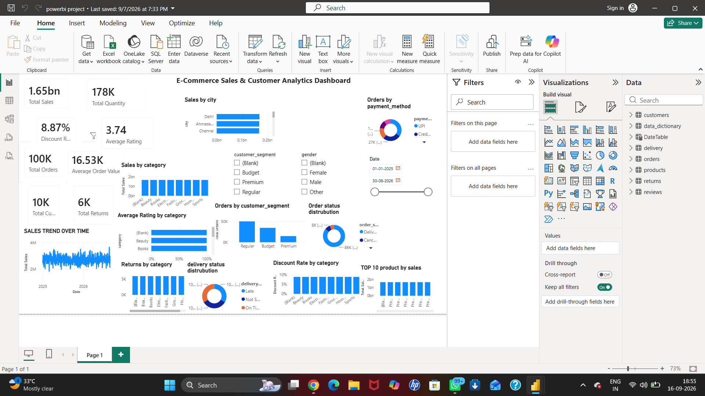

# E-Commerce Sales & Customer Analytics — Power BI

## 📊 Project Overview

This project analyzes e-commerce sales and customer data using **Microsoft Power BI** to understand sales performance, customer behavior, product performance, discounts, returns, reviews, and delivery operations.

The project combines multiple datasets related to **customers, products, orders, reviews, returns, and delivery** and transforms them into an interactive business intelligence dashboard.

The goal is to convert raw e-commerce data into meaningful insights that can support **data-driven business decisions**.

---

## 🎯 Business Problem

An e-commerce company generates large amounts of data from customer transactions, products, orders, reviews, returns, and deliveries.

The company needs to answer questions such as:

* How much revenue is being generated?
* Which cities and categories perform best?
* Which products contribute the most sales?
* Which customer segments generate the most orders?
* How effective are discounts?
* What is the return rate?
* How satisfied are customers?
* What are the current order and delivery statuses?
* Which areas require business improvement?

This project addresses these questions through an interactive Power BI dashboard.

---

## 🗂️ Datasets

The project uses multiple related datasets:

* `customers.csv`
* `products.csv`
* `orders.csv`
* `reviews.csv`
* `returns.csv`
* `delivery.csv`
* `data_dictionary.csv`

The datasets are connected using common identifiers such as:

* `customer_id`
* `product_id`
* `order_id`

A separate **DateTable** was also created for date-based analysis.

---

## 🛠️ Tools & Technologies

| Tool                   | Purpose                                         |
| ---------------------- | ----------------------------------------------- |
| **Microsoft Power BI** | Dashboard development and data visualization    |
| **Power Query**        | Data loading, cleaning, and transformation      |
| **DAX**                | Calculated measures and business KPIs           |
| **Microsoft Excel**    | Initial data inspection and data-quality checks |

---

## 🧹 Data Cleaning

The datasets were inspected and prepared before being loaded into the Power BI data model.

The data-cleaning process included:

* Checking for missing values
* Checking for duplicate records
* Validating required columns
* Checking data types
* Verifying identifiers
* Preparing datasets for relationships
* Transforming data using Power Query

The cleaned datasets were then loaded into Power BI for analysis.

---

## 🔗 Data Modeling

A relational data model was created in Power BI using common identifiers.

The main relationships include:

* **Customers → Orders**
* **Customers → Reviews**
* **Products → Orders**
* **Orders → Reviews**
* **Orders → Returns**
* **Orders → Delivery**
* **DateTable → Orders**

This model allows users to interactively analyze sales, customers, products, reviews, returns, and delivery performance.

---

## 📐 Key DAX Measures

### Total Sales

```DAX
Total Sales =
SUM(Orders[Gross Amount]) - SUM(Orders[Discount Amount])
```

### Average Order Value

```DAX
Average Order Value =
DIVIDE([Total Sales], [Total Orders], 0)
```

### Return Rate

```DAX
Return Rate =
DIVIDE([Total Returns], [Total Orders], 0)
```

Other dashboard KPIs include:

* Total Sales
* Total Quantity
* Total Orders
* Total Customers
* Total Returns
* Discount Rate
* Average Rating
* Average Order Value

---

## 📊 Dashboard

The Power BI dashboard provides a single-page operational overview of the e-commerce business.

### KPI Cards

The dashboard displays:

* 💰 Total Sales
* 📦 Total Quantity
* 🛒 Total Orders
* 👥 Total Customers
* 🔄 Total Returns
* ⭐ Average Rating
* 💵 Average Order Value
* 🏷️ Discount Rate

### Sales & Category Analysis

Visualizations include:

* Sales by City
* Sales by Category
* Returns by Category
* Discount Rate by Category

### Product & Customer Analysis

The dashboard includes:

* Top 10 Products by Sales
* Customer Segment Distribution
* Gender-based analysis

### Operations & Fulfillment

Operational analysis includes:

* Delivery Status
* Order Status
* Payment Methods

---

## 🔍 Key Business Insights

### 💰 Financial Performance

* **Total Sales:** ₹1.65 billion
* **Total Orders:** 100K
* **Average Order Value:** ₹16.53K
* **Total Quantity:** 178K units

The overall sales performance indicates a strong transaction volume across the e-commerce business.

### 🛍️ Category Performance

Sales are relatively distributed across major categories including:

* Beauty
* Books
* Electronics
* Fashion
* Home
* Sports

The Top 10 products also make a strong contribution to overall revenue.

### 👥 Customer Segments

The **Regular** customer segment represents the largest order volume at approximately **50K orders**, followed by:

* Budget — approximately 30K orders
* Premium — approximately 18K orders

This indicates a significant opportunity to convert regular customers into higher-value loyal customers.

### 🌍 Geographic Performance

Among the major cities, **Delhi** records the highest sales, followed by **Ahmedabad** and **Chennai**.

These cities can provide useful benchmarks for regional sales strategies.

### 🏷️ Discounts & Returns

* **Overall Discount Rate:** 8.87%
* **Total Returns:** approximately 6K
* **Return Rate:** approximately 6%

Returns are distributed across the major product categories.

### ⭐ Customer Satisfaction

The overall average customer rating is:

**3.74 / 5**

This indicates a moderate level of customer satisfaction and provides an opportunity to investigate product quality, delivery experience, and return reasons.

---

## 💡 Business Recommendations

### 1. Target the Regular Customer Segment

Develop loyalty programs, personalized offers, and upselling strategies for regular customers to encourage movement toward the Premium segment.

### 2. Replicate Successful City Strategies

Study the sales strategies used in Delhi and apply successful approaches to other high-potential cities such as Ahmedabad and Chennai.

### 3. Reduce Product Returns

Analyze return reasons such as:

* Product defects
* Incorrect product expectations
* Sizing issues
* Delivery problems

Using these insights can help reduce unnecessary returns.

### 4. Maintain Balanced Discounting

Continue monitoring the **8.87% discount rate** while ensuring that discounts increase sales without unnecessarily reducing profit margins.

### 5. Improve Customer Satisfaction

Investigate products and operational areas associated with lower ratings and use customer feedback to improve the overall shopping experience.

---

## 📈 Project Outcomes

This project demonstrates the ability to:

* Work with multiple related datasets
* Perform data-quality checks
* Clean and transform data using Power Query
* Build relationships between tables
* Create DAX measures
* Design an interactive Power BI dashboard
* Analyze customer and sales behavior
* Identify business trends
* Convert data into actionable business recommendations

---

## 🖥️ Dashboard Preview

 Power BI dashboard screenshot:

```text

```
## 📊 Power BI Dashboard


---

## 📁 Project Structure

```text
E-Commerce-Sales-Customer-Analytics/
│
├── customers.csv
├── products.csv
├── orders.csv
├── reviews.csv
├── returns.csv
├── delivery.csv
├── data_dictionary.csv
│
├── E-Commerce-Sales-Customer-Analytics.pbix
├── dashboard.png
└── README.md
```

---

## 🚀 How to Use

1. Download or clone this repository.
2. Open the `.pbix` file using Microsoft Power BI Desktop.
3. Check the data sources if required.
4. Refresh the data.
5. Explore the dashboard using the available slicers and visualizations.

---

## 🎓 Skills Demonstrated

**Data Analysis**

* Sales Analysis
* Customer Analytics
* Product Analysis
* Return Analysis
* Delivery Analysis
* Business Intelligence

**Power BI**

* Power Query
* Data Modeling
* DAX
* KPI Cards
* Interactive Visualizations
* Slicers
* Dashboard Design

**Data Quality**

* Missing-value checks
* Duplicate checks
* Data-type validation
* Relationship validation

---

## 📌 Conclusion

This project demonstrates how **Power BI can transform raw e-commerce data into meaningful business insights**.

By combining customer, product, order, review, return, and delivery data, the dashboard provides a comprehensive view of business performance.

The analysis helps identify key customer segments, high-performing cities and products, discount patterns, return behavior, and customer satisfaction levels, enabling businesses to make more informed and data-driven decisions.

---

## 👩‍💻 Author

**Mounika Chinthati**

**B.Tech — Computer Science & Engineering (AI & ML)**

**Skills:** Power BI | Excel | SQL | Data Cleaning | Data Analysis
